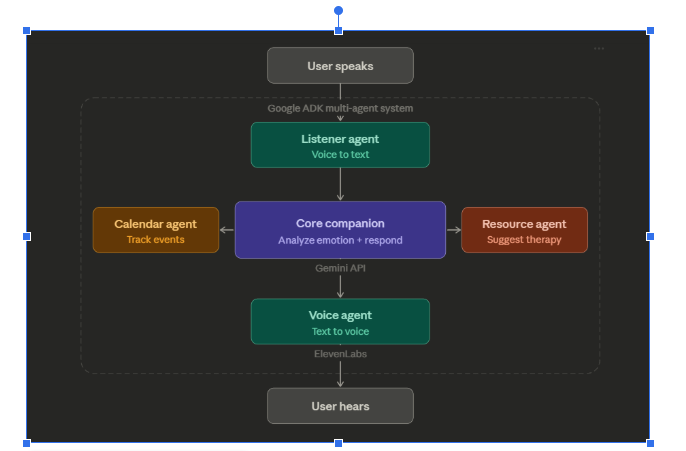

# SoulSync

**AI-Powered Mental Health Companion for Burnout, Stress & Loneliness**

> Built with love at USF Hackathon Tampa 2026.

---

## What is SoulSync?

SoulSync is a **voice-first** AI companion that listens to you, understands your emotions, and responds with empathy — using natural voice. It proactively helps by saving calendar events, suggesting therapy resources, and guiding you through mindfulness exercises.

**You speak. SoulSync listens. You feel heard.**

---

## Hackathon Tracks

| Track | How We Use It |
|-------|--------------|
| **Oracle** | Human-centered AI — empathetic, proactive mental health support |
| **Google ADK Multi-Agent** | Multi-agent orchestration with specialized sub-agents |
| **ElevenLabs** | Natural voice output via Text-to-Speech API |
| **Gemini API** | Emotion analysis + conversational AI responses |

---

## Architecture



```
root_agent (agent.py) — ADK entry point, orchestrator
├── sub_agents:
│   ├── core_companion_agent   ← Gemini: emotion analysis + empathetic response
│   │   └── tools: analyze_emotion, suggest_resource
│   ├── calendar_agent         ← save/list events (in-memory store)
│   │   └── tools: save_event, list_events
│   └── resource_agent         ← crisis hotlines, therapy refs, mindfulness
│       └── tools: get_crisis_resources, get_therapist_resources, get_mindfulness_exercise
└── tools: [] (pure orchestrator)

voice_agent  ← ElevenLabs TTS utility, called by backend post-response
```

---

## Tech Stack

| Layer | Technology |
|-------|-----------|
| **Frontend** | React + Vite + TypeScript |
| **Backend** | Python + FastAPI + WebSocket |
| **Agents** | Google ADK (Python) |
| **LLM** | Gemini API (`gemini-3-flash-preview`) |
| **Voice Output** | ElevenLabs TTS |
| **Voice Input** | Web Speech API (browser-side) |
| **Database** | In-memory (hackathon scope) |
| **Deploy** | Vercel (frontend) · Railway/Render (backend) |

---

## Project Structure

```
SoulSync/
├── frontend/                  # React + Vite + TypeScript
│   └── src/
│       ├── App.tsx
│       ├── components/
│       ├── hooks/
│       ├── types/
│       └── utils/
├── backend/                   # FastAPI + WebSocket
│   └── main.py
├── multi_tool_agent/          # Google ADK agents (adk run target)
│   ├── agent.py               # ADK entry point — root_agent (orchestrator)
│   ├── core_companion.py      # Emotion analysis + empathetic response
│   ├── calendar_agent.py      # Event/deadline management
│   ├── resource_agent.py      # Crisis hotlines + therapy resources
│   ├── listener_agent.py      # Voice-to-text stub (browser handles STT)
│   ├── voice_agent.py         # ElevenLabs TTS utility
│   ├── __init__.py
│   └── CLAUDE.md
├── .env                       # API keys (never commit!)
├── requirements.txt
├── CLAUDE.md
└── README.md
```

---

## Getting Started

### Prerequisites

- Python 3.10+
- Node.js 18+
- API keys (see below)

### 1. Clone the repo

```bash
git clone https://github.com/Davii-Ng/SoulSync.git
cd SoulSync
```

### 2. Set up environment variables

Create a `.env` file in the project root:

```env
GOOGLE_API_KEY=your_gemini_api_key
ELEVENLABS_API_KEY=your_elevenlabs_api_key
GOOGLE_CLOUD_PROJECT=your_gcp_project_id  # if needed
```

### 3. Install Python dependencies

```bash
pip install -r requirements.txt
```

### 4. Run the agents (Google ADK)

```bash
# From project root (SoulSync/)
adk run multi_tool_agent     # terminal chat
adk web multi_tool_agent     # browser UI at localhost:8000
```

### 5. Start the backend

```bash
# From project root (SoulSync/)
python -m uvicorn backend.main:app --reload
# → http://localhost:8000
```

### 6. Start the frontend

```bash
cd frontend
npm install
npm run dev
# → http://localhost:5173
```
