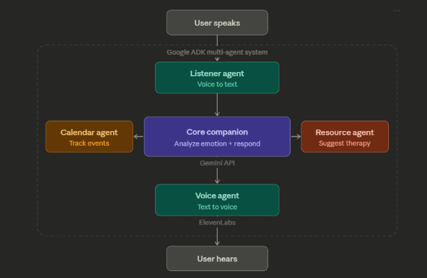

# SoulSync

**AI-Powered Journal & Mental Health Companion**

> Built with love at USF Hackathon Tampa 2026.

---

## What is SoulSync?

SoulSync is a **voice-first AI journal** that listens to you, understands your emotions, and responds like a friend — not a chatbot. Write or speak your thoughts, and SoulSync helps you process them, reflect on past entries, and feel less alone.

**You speak. SoulSync listens. You feel heard.**

---

## Hackathon Tracks

| Track | How We Use It |
|-------|--------------|
| **Oracle** | Human-centered AI — empathetic, proactive mental health support |
| **Google ADK Multi-Agent** | Multi-agent orchestration with 4 specialized sub-agents |
| **ElevenLabs** | Natural voice I/O — TTS via SDK + STT via Scribe MCP |
| **Gemini API** | Emotion analysis + conversational AI responses |

---

## Architecture



```
User speaks into mic (browser)
    │
    ▼  Web Speech API or base64 audio
┌─────────────────────────────────────────────────┐
│              Frontend (React + Vite)              │
│  VoiceOrb → useVoiceInput → useWebSocket         │
│  Quick Check-In → mood selection → auto-send      │
│  Journal auto-save → localStorage snapshot        │
│  Voice selection → /voices API + WS set_voice     │
└───────────────────┬─────────────────────────────┘
                    │  WebSocket (ws://localhost:8000/ws)
                    │  Auto-reconnect w/ exponential backoff
                    ▼
┌─────────────────────────────────────────────────┐
│          Backend (FastAPI + WebSocket)            │
│  /chat  /speech  /transcribe  /voices  /ws       │
│  analyze_emotion + Gemini LLM + ElevenLabs TTS   │
│  Per-connection voice prefs + chat history (20)   │
└───────────────────┬─────────────────────────────┘
                    │  Routes to ADK agents
                    ▼
┌─────────────────────────────────────────────────┐
│       root_agent (ADK Orchestrator)              │
│                                                   │
│  sub_agents:                                      │
│  ├── core_companion  → analyze_emotion,           │
│  │                     suggest_resource            │
│  ├── journal_agent   → write_entry, get_entries,  │
│  │                     save_journal, get_prompt    │
│  ├── calendar_agent  → save_event, get_events     │
│  └── resource_agent  → crisis hotlines,           │
│                        therapist refs, mindfulness,│
│                        search_local_resources      │
│                                                   │
│  Backend utilities (not sub_agents):              │
│  ├── voice_agent     → ElevenLabs TTS             │
└───────────────────────────────────────────────────┘
```

---

## Tech Stack

| Layer | Technology |
|-------|-----------|
| **Frontend** | React 19 + Vite + TypeScript + Tailwind CSS 4 |
| **Backend** | Python + FastAPI + Uvicorn |
| **Agents** | Google ADK (Python) — multi-agent orchestration |
| **LLM** | Gemini API (`gemini-3-flash-preview`) |
| **Voice Output** | ElevenLabs TTS (Python SDK, `eleven_multilingual_v2`) |
| **Voice Input** | Web Speech API (browser) + ElevenLabs Scribe STT (server via MCP) |
| **Real-time** | WebSocket — text + audio + emotion + events in a single message |
| **Storage** | In-memory (backend) + localStorage (frontend journals & voice prefs) |
| **Deploy** | Vercel (frontend) · Railway/Render (backend) |

---

## Key Features

### Emotion Detection
- **8 emotions:** calm, stressed, anxious, happy, sad, angry, neutral, crisis
- **Tiered keyword scoring:** high (3.0), medium (2.0), low (1.0) weights per emotion
- **Negation-aware:** "I'm not angry" won't trigger angry detection
- **Mixed emotions:** returns primary + secondary emotion when secondary is >= 40% of primary score
- **Dynamic severity:** low (< 3.0), medium (>= 3.0), high (>= 6.0) based on keyword count

### Crisis Detection
- 16 direct crisis phrases (e.g., "want to die", "suicide", "self-harm") → immediate crisis response
- 9 passive crisis phrases (e.g., "what's the point", "i'm a burden") → triggers on 2+ matches or 1 match + high severity
- Auto-routes to resource_agent with 988 hotline and crisis resources

### Quick Check-In
- 7 mood buttons on the Speak page: Amazing, Peaceful, Unsure, Worried, Sad, Frustrated, Drained
- One-tap mood logging that auto-sends to AI (e.g., "I'm feeling peaceful right now")
- Visual feedback with auto-reset after 3 seconds

### Journal Auto-Save
- Trigger phrases: "save today", "save journal", "done for the day", "wrap up"
- Frontend detects phrases instantly and snapshots full conversation to localStorage
- Backend also signals via `journal_saved` flag for agent-initiated saves
- Saved journals viewable on the Journal page with expandable daily entries and dominant emotion

### Voice Selection
- Settings page fetches available voices from ElevenLabs via `GET /voices`
- Filter by gender (All / Female / Male) and sort by name or gender
- Preview any voice before selecting via `POST /voices/preview`
- Selected voice persisted to localStorage and sent to backend via WebSocket `set_voice`
- Per-message voice override supported

### Calendar Event Extraction
- AI detects event/deadline mentions in conversation and saves them automatically
- Events extracted, normalized, and deduplicated from agent responses
- Viewable on the Calendar page as a card grid

### Local Resource Search
- `search_local_resources` tool searches DuckDuckGo for therapists and support groups near a user's location
- Falls back to curated links (Psychology Today, SAMHSA, Open Path) if search fails

### Interactive Wellness Widgets
- **Box Breathing guide:** 4-phase cycle (inhale → hold → exhale → hold) with animated visuals and cycle counter
- **5-4-3-2-1 Grounding walkthrough:** step-by-step sensory exercise (see, touch, hear, smell, taste)
- Widgets highlight automatically based on detected emotion (anxious → breathing, stressed → grounding)

### Connection Status
- Real-time green/red indicator in the header showing WebSocket connection state
- Auto-reconnect with exponential backoff (3 retries: 1s → 2s → 4s)

---

## Project Structure

```
SoulSync/
├── frontend/                  # React + Vite + TypeScript
│   └── src/
│       ├── App.tsx            # Root — routing, state, WebSocket wiring
│       ├── components/
│       │   ├── Layout.tsx         # App shell — header, retractable sidebar, bottom nav pill
│       │   ├── VoiceOrb.tsx       # Mic button with idle/listening/thinking/speaking states
│       │   ├── ChatTranscript.tsx # Auto-scrolling message list
│       │   ├── MessageBubble.tsx  # User/AI message bubbles with voice name
│       │   ├── EmotionBadge.tsx   # Color-coded emotion pill badge
│       │   ├── Header.tsx         # Brand, connection status dot, profile avatar
│       │   ├── TextInput.tsx      # Text input with send button + loading state
│       │   ├── AudioPlayer.tsx    # Inline audio player with waveform visualization
│       │   ├── EventsPanel.tsx    # Calendar events sidebar panel
│       │   ├── QuickCheckIn.tsx   # 7-mood emoji buttons with auto-reset
│       │   └── ResourcesCard.tsx  # Interactive breathing guide + grounding walkthrough
│       ├── pages/
│       │   ├── SpeakingPage.tsx   # Main voice/chat interface — orb, transcript, quick check-in
│       │   ├── JournalPage.tsx    # Expandable daily entries with dominant emotion
│       │   ├── CalendarPage.tsx   # Event card grid from AI-extracted events
│       │   ├── HistoryPage.tsx    # Mood timeline + weekly bar chart
│       │   ├── ResourcesPage.tsx  # Crisis hotlines, therapy finders, mindfulness exercises
│       │   └── SettingsPage.tsx   # Voice browsing, gender filter, preview & selection
│       ├── hooks/
│       │   ├── useWebSocket.ts    # WS connection with auto-reconnect + exponential backoff
│       │   └── useVoiceInput.ts   # Web Speech API with continuous mode + interim results
│       ├── types/
│       │   ├── index.ts           # Emotion, OrbState, Message types
│       │   └── speech.d.ts        # Web Speech API type declarations
│       └── utils/
│           └── constants.ts       # App-wide constants
├── backend/                   # FastAPI — API integration layer
│   ├── main.py                # App entry, CORS, router registration
│   └── app/
│       ├── api/routes/
│       │   ├── health.py      # GET /
│       │   ├── chat.py        # POST /chat
│       │   ├── speech.py      # POST /speech, GET /voices, POST /voices/preview, POST /transcribe
│       │   └── ws.py          # WS /ws — real-time conversation + voice prefs + event extraction
│       ├── core/              # Config (.env loading), CORS, security
│       ├── schemas/           # Pydantic models (ChatRequest/Response, SpeechRequest, etc.)
│       ├── services/
│       │   └── agent_runner.py  # ADK runner, session mgmt, event extraction + dedup, emotion fallback
│       ├── ws/                # ConnectionManager
│       └── utils/             # ServiceError exception + handler
├── multi_tool_agent/          # Google ADK agents
│   ├── agent.py               # ADK entry point — root_agent orchestrator
│   ├── core_companion.py      # Emotion analysis (negation-aware, crisis detection) + suggest_resource
│   ├── journal_agent.py       # write_entry, get_entries, save_journal, get_prompt
│   ├── calendar_agent.py      # save_event, get_events — in-memory calendar
│   ├── resource_agent.py      # Crisis hotlines, therapy refs, mindfulness, search_local_resources
│   ├── voice_agent.py         # TTS via ElevenLabs SDK
│   └── __init__.py
├── tests/                     # pytest tests
├── .env                       # API keys (never commit!)
└── README.md
```

---

## API Endpoints

| Method | Path | Description |
|--------|------|-------------|
| GET | `/` | Health check — returns `{status, service, version}` |
| POST | `/chat` | Send text + optional context, get AI response + emotion + events |
| POST | `/speech` | Convert text to speech (optional `voice_id`), returns `audio/mpeg` |
| GET | `/voices` | List available ElevenLabs voices with `voice_id`, `name`, `gender` |
| POST | `/voices/preview` | Preview a voice with sample phrase, returns `audio/mpeg` |
| POST | `/transcribe` | Convert base64 audio to text via ElevenLabs Scribe (optional `language_code`) |
| WS | `/ws` | Real-time conversation — text/audio in, AI response + emotion + TTS + events + journal signals out |

### WebSocket Protocol (`/ws`)

**Send (client → server):**
```json
{ "type": "text", "content": "I feel so burned out" }
{ "type": "text", "content": "hello", "voice_id": "optional-override" }
{ "type": "audio", "content": "<base64-encoded-audio>" }
{ "type": "set_voice", "voice_id": "elevenlabs-voice-id" }
```

**Receive (server → client):**
```json
{ "type": "transcript", "content": "transcribed text" }
{ "type": "response", "content": "AI reply", "emotion": "stressed", "audio_base64": "...", "events": [...], "journal_saved": true, "tts_error": "..." }
{ "type": "voice_set", "voice_id": "elevenlabs-voice-id" }
{ "type": "error", "content": "error message" }
```

**Response fields:**
- `events` — calendar events extracted from the conversation (optional)
- `journal_saved` — signals the frontend to snapshot the conversation to localStorage (optional)
- `tts_error` — present when TTS fails (e.g., quota exceeded), response still contains text (optional)

**Connection behavior:** auto-reconnect with exponential backoff (3 retries, 1s → 2s → 4s). Chat history capped at 20 messages per connection to stay within token limits.

---

## Getting Started

### Prerequisites

- Python 3.11+
- Node.js 18+
- API keys (see below)

### 1. Clone the repo

```bash
git clone https://github.com/Davii-Ng/SoulSync.git
cd SoulSync
```

### 2. Set up environment variables

Create a `.env` file in the project root:

```env
# Required
GOOGLE_API_KEY=your_gemini_api_key
ELEVENLABS_API_KEY=your_elevenlabs_api_key
```

Optional:

```env
GOOGLE_CLOUD_PROJECT=your_gcp_project_id
ELEVENLABS_VOICE_ID=JBFqnCBsd6RMkjVDRZzb       # Default TTS voice
ELEVENLABS_MODEL_ID=eleven_multilingual_v2        # TTS model
CORS_ORIGINS=http://localhost:5173                # Comma-separated allowed origins
APP_ENV=development                               # development | production
LOG_LEVEL=INFO                                    # Python logging level
REQUEST_TIMEOUT_SECONDS=20                        # Backend request timeout
```

Frontend (optional, in `frontend/.env`):

```env
VITE_WS_URL=ws://localhost:8000/ws                # WebSocket endpoint
VITE_API_URL=http://localhost:8000                 # HTTP API endpoint
```

### 3. Install Python dependencies

```bash
pip install -r backend/requirements.txt
```

### 4. Start the backend

```bash
cd backend
uvicorn main:app --reload --host 0.0.0.0 --port 8000
# → http://localhost:8000
# → Swagger docs at http://localhost:8000/docs
```

### 5. Start the frontend

```bash
cd frontend
npm install
npm run dev
# → http://localhost:5173
```

### 6. (Optional) Run agents standalone via ADK

```bash
# From project root (SoulSync/)
adk run multi_tool_agent     # terminal chat
adk web .                    # browser UI at localhost:8000
adk web . --port 8080        # use 8080 if backend is on 8000
```

---

## Running Tests

```bash
pip install pytest pytest-asyncio httpx
pytest -q
```

---

## Demo Walkthrough

1. Open `http://localhost:5173` in Chrome (required for Web Speech API).
2. You land on the **Speak** page — the main voice/chat interface.
3. Click the **voice orb** to start speaking, or type a message in the text input.
4. Say something like _"I've been feeling really burned out lately"_.
5. Click the orb again to stop — your message appears in the transcript.
6. SoulSync analyzes your emotion, responds empathetically, and speaks the reply aloud.
7. The **emotion badge** updates to reflect the detected mood (stressed, anxious, sad, angry, happy, calm, neutral, crisis).
8. Try the **Quick Check-In** — tap a mood emoji to log how you're feeling instantly.
9. Mention an event: _"I have a therapy appointment next Tuesday at 3pm"_ — it auto-saves to the Calendar.
10. Say _"save today's journal"_ or _"done for the day"_ — the conversation snapshots to your Journal.
11. Use the **bottom nav** to explore:
    - **Speak** — main voice/chat interface with orb, emotion badge, and quick check-in.
    - **Journal** — expandable daily entries with dominant emotion per day.
    - **Calendar** — grid of events and deadlines extracted from conversations.
12. Open the **sidebar** (desktop) for more:
    - **History** — mood timeline with emotion icons and message snippets.
    - **Resources** — crisis hotlines (988), therapy finders, and interactive mindfulness exercises (box breathing, 5-4-3-2-1 grounding).
    - **Settings** — browse, preview, and select ElevenLabs voices with gender filters.

---

## Multi-Agent Tools Reference

| Agent | Tools | Purpose |
|-------|-------|---------|
| **root_agent** | _(none — routes only)_ | Orchestrates all sub-agents, never responds directly |
| **core_companion** | `analyze_emotion`, `suggest_resource` | Emotion detection (negation-aware, crisis, mixed) + coping tips |
| **journal_agent** | `write_entry`, `get_entries`, `save_journal`, `get_prompt` | Journal CRUD + reflective prompts per emotion |
| **calendar_agent** | `save_event`, `get_events` | Auto-extract events/deadlines from conversation |
| **resource_agent** | `get_crisis_resources`, `get_therapist_resources`, `get_mindfulness_exercise`, `search_local_resources` | Crisis hotlines, therapy finders, grounding exercises, local search |
| **voice_agent** | `speak_response` | ElevenLabs TTS (backend utility, not a sub_agent) |


---

## Troubleshooting

| Problem | Fix |
|---------|-----|
| Mic not working | Use Chrome — Web Speech API requires it. Allow mic permission when prompted. |
| No AI response | Check that `GOOGLE_API_KEY` is set in `.env` and the backend is running. |
| No voice output | Check that `ELEVENLABS_API_KEY` is set. Verify at `http://localhost:8000/docs` → POST `/speech`. |
| TTS quota error | ElevenLabs free tier has limits. Response text still works — only audio is missing. Check `tts_error` in WS response. |
| WebSocket disconnect | Ensure backend is running on port 8000. Frontend auto-reconnects 3 times with backoff. Check browser console. |
| Voices not loading | Backend must be running. Check `GET http://localhost:8000/voices` returns a list. |
| Journal not saving | Say "save today's journal" or "done for the day". Check localStorage in browser DevTools. |
| `adk run` fails | Run from project root (`SoulSync/`), not from inside `multi_tool_agent/`. |