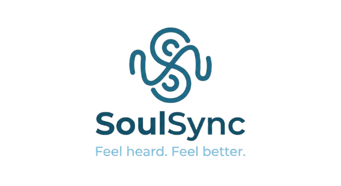
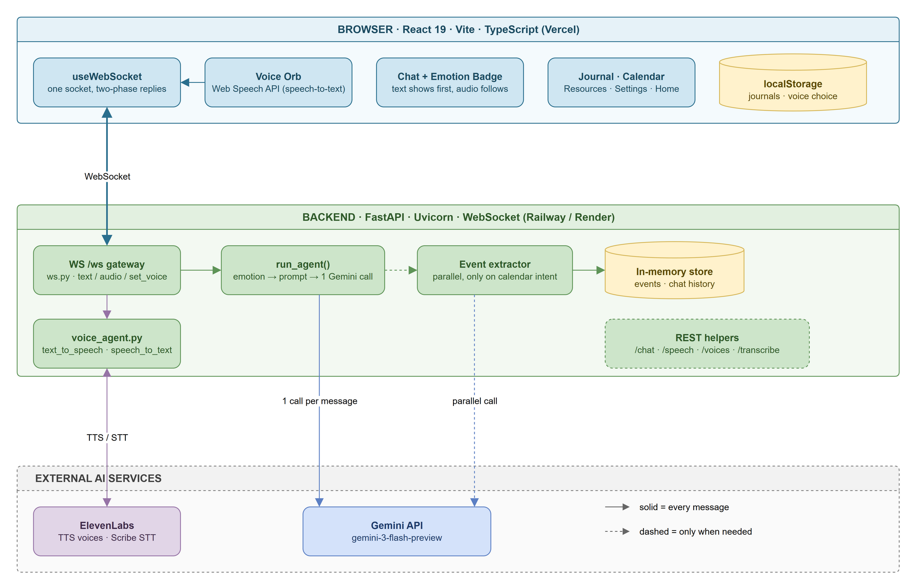
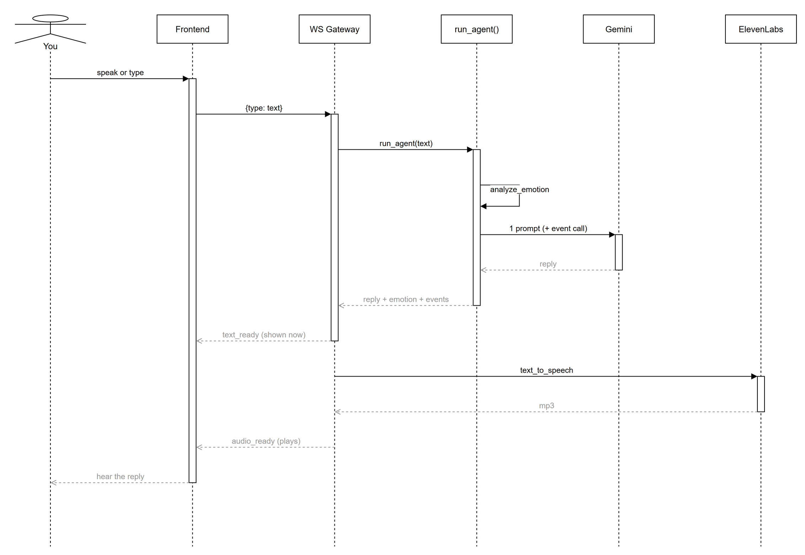
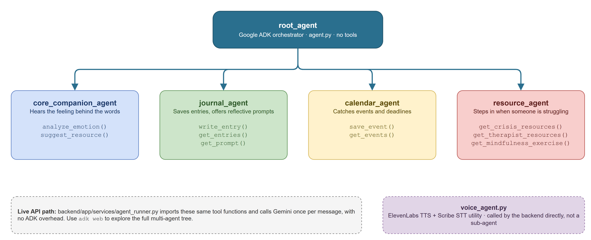

<div align="center">



# SoulSync

### A voice-first AI journal that listens, understands, and answers like a friend.

[](https://soul-sync-rose.vercel.app/)
[](https://devpost.com/software/soulsync-plkwy8)


[Overview](#-overview) · [Features](#-features) · [Quick start](#-quick-start) · [Architecture](#-architecture) · [Results](#-measured-results) · [Next steps](#-next-steps) · [Team](#-team)

</div>

---

## 💙 Overview

We are more connected to screens than ever, and more isolated from real people. Most journaling apps are a blank page waiting for you to do the work.

**SoulSync flips that.** You talk. It listens to what you say, reads the emotion in it, and replies out loud like a caring friend. It saves the day to your journal, catches the appointments you mention, and steps in with crisis resources if you need them.

| You do | SoulSync does |
| --- | --- |
| 🎙️ Speak or type | Transcribes it (Web Speech API) |
| 💭 Share how you feel | Detects emotion and severity, with negation and mixed feelings handled |
| 🤝 Keep talking | Replies in 2–3 warm sentences, then speaks them with ElevenLabs |
| 📅 Mention "dentist Friday at 3" | Pulls out the event and puts it on your calendar |
| 📓 Say "that's it for today" | Saves the conversation as a journal entry |
| 🆘 Say something alarming | Surfaces 988 and other crisis resources right away |

> Built at **HackUSF 2026** for the Oracle (human-centered AI), Google ADK multi-agent, ElevenLabs, and Gemini API tracks.

## ✨ Features

- **Voice-first loop.** Orb to speech to reply to voice, with a typed fallback.
- **Emotion engine.** Eight labels (`calm` `stressed` `anxious` `happy` `sad` `angry` `neutral` `crisis`). Crisis phrases are checked first. Negation-aware, so "I'm not angry" stays neutral. Returns a primary and a secondary emotion.
- **Fast two-phase replies.** Text appears as soon as Gemini answers. Audio streams in afterwards, so you never wait on TTS to read the reply.
- **Safety net.** Crisis detection adds hotline details to the prompt at zero extra latency.
- **Journal and calendar.** Conversations snapshot into daily entries. Events are extracted in parallel with the reply.
- **Choose your voice.** Browse and preview ElevenLabs voices in Settings.
- **Wellness toolkit.** Resources page with grounding and breathing exercises.

## 🚀 Quick start

**You need:** Python 3.11+, Node.js 18+, a [Gemini API key](https://aistudio.google.com/apikey), and an [ElevenLabs API key](https://elevenlabs.io).

**1. Clone and add your keys**

```bash
git clone https://github.com/Davii-Ng/SoulSync.git
cd SoulSync
cp .env.example .env        # then fill in GOOGLE_API_KEY and ELEVENLABS_API_KEY
```

**2. Start the backend** → http://localhost:8000

```bash
python -m venv venv && source venv/bin/activate     # Windows: venv\Scripts\activate
pip install -r backend/requirements.txt
cd backend && uvicorn main:app --reload --port 8000
```

**3. Start the frontend** → http://localhost:5173

```bash
cd frontend
npm install
npm run dev
```

Open the app, click the orb, and say hello. Chrome or Edge is best for the Web Speech API.

<details>
<summary><b>Environment variables</b></summary>

| Variable | Required | Purpose |
| --- | :---: | --- |
| `GOOGLE_API_KEY` | ✅ | Gemini API |
| `ELEVENLABS_API_KEY` | ✅ | Text-to-speech and speech-to-text |
| `ELEVENLABS_VOICE_ID` | | Default voice (a sensible default is set) |
| `ELEVENLABS_MODEL_ID` | | Defaults to `eleven_multilingual_v2` |
| `GOOGLE_CLOUD_PROJECT` | | Only for ADK features that need it |
| `CORS_ORIGINS` | | Defaults to `http://localhost:5173` |
| `VITE_WS_URL` | | Set in `frontend/.env` to point at a non-local backend, e.g. `ws://localhost:8000/ws` |

The backend exits at startup if `GOOGLE_API_KEY` or `ELEVENLABS_API_KEY` is missing. Never commit `.env`.

</details>

<details>
<summary><b>Explore the multi-agent tree, run tests, troubleshoot</b></summary>

```bash
adk web multi_tool_agent      # browser UI for the Google ADK agents at localhost:8000
adk run multi_tool_agent      # terminal chat with the same agents
cd backend && pytest -q       # backend tests
```

| Symptom | Fix |
| --- | --- |
| Backend exits on start | Check `.env` has both API keys |
| Orb does nothing | Use Chrome or Edge and allow microphone access |
| "Not connected to server" | Start the backend, then check `VITE_WS_URL` |
| "Voice unavailable" message | ElevenLabs quota is used up. Text replies still work. |

</details>

## 🏗️ Architecture

SoulSync is a React single-page app talking to a FastAPI backend over one WebSocket. The backend calls Gemini for the reply and ElevenLabs for the voice.

<p align="center">
  
</p>

### What happens to one message

The backend runs emotion analysis in plain Python (no LLM), then makes **one** Gemini call per message. It sends the text to the UI first and the audio second, so the reply feels instant.

<p align="center">
  
</p>

**WebSocket protocol** (`ws://<host>/ws`)

| Direction | Message | Meaning |
| --- | --- | --- |
| Client → Server | `{ "type": "text", "content": "…" }` | User message |
| Client → Server | `{ "type": "audio", "content": "<base64>" }` | Audio to transcribe, then answer |
| Client → Server | `{ "type": "set_voice", "voice_id": "…" }` | Choose a voice for this connection |
| Server → Client | `{ "type": "text_ready", "content", "emotion", "events?", "journal_saved?" }` | Reply text, shown immediately |
| Server → Client | `{ "type": "audio_ready", "audio_base64" }` | Reply voice, plays when it arrives |
| Server → Client | `{ "type": "audio_error", "tts_error" }` | Voice failed, text is already on screen |
| Server → Client | `{ "type": "transcript" \| "voice_set" \| "error" }` | Status events |

REST helpers: `GET /` (health), `POST /chat`, `POST /speech`, `GET /voices`, `POST /voices/preview`, `POST /transcribe`.

### The agent team (Google ADK)

The `multi_tool_agent/` package defines a `root_agent` that delegates to four specialist sub-agents. Their tool functions are the building blocks of the product. The live API path imports them directly and skips ADK orchestration to stay at one LLM call per message. Use `adk web` to see the full multi-agent tree.

<p align="center">
  
</p>

### Repository map

```text
SoulSync/
├── frontend/            React + Vite + TypeScript app (pages, hooks, components)
├── backend/             FastAPI app: WebSocket gateway, REST routes, agent_runner pipeline
├── multi_tool_agent/    Google ADK agents and their tools (emotion, journal, calendar, resources, voice)
├── docs/diagrams/       Editable .drawio sources and exported PNGs used above
└── assets/              Logos and brand images
```

Each of `frontend/`, `backend/`, and `multi_tool_agent/` has its own `CLAUDE.md` with conventions for contributors and AI coding agents.

## 📊 Measured results

Every number comes from a script in [`benchmarks/`](benchmarks/) and can be rerun. Full tables, sample sizes and caveats: [`benchmarks/RESULTS.md`](benchmarks/RESULTS.md).

| What | Result |
| --- | --- |
| Crisis detection recall | **100%** on 30 crisis messages (a CI gate fails the build below 100%) |
| Crisis false positives | 2.8% across 144 non-crisis messages |
| Emotion engine speed | ~17 µs per message, no LLM call |
| Backend under load (providers stubbed) | 200 concurrent sessions, 1,000 messages, 0 errors |
| Tests | 142 across backend, agents and frontend, run in CI |
| Live site, desktop Lighthouse | 100 performance, 96 best practices |

Known limits, measured: the keyword emotion engine scores only 16.8% on an external tweet dataset (Gemini handles nuance; the engine exists for instant crisis checks), and throughput plateaus near 17 messages per second because provider calls use Python's default thread pool.

```bash
python benchmarks/eval_emotion.py --gate   # accuracy + crisis recall
python benchmarks/bench_load.py            # concurrency ladder
python benchmarks/report.py                # rebuild benchmarks/RESULTS.md
```

## 🧭 Next steps

> Draft from our Devpost. To be finalized.

- **Persistence.** Move from in-memory storage to a real database.
- **Mood analytics.** Trend charts across days and weeks.
- **Context-aware agents.** Spot patterns in behavior over time.
- **Mobile.** Native iOS and Android apps with push reminders.
- **Therapist sharing.** Let users share journal summaries and mood data on their terms.

## 👥 Team

Built in a weekend at HackUSF 2026 by **Ngoc Viet Nguyen**, **Minh Duong Nguyen**, and **Gia Huy Chau**.

Want to help? Read [CONTRIBUTING.md](CONTRIBUTING.md). Licensed under [LICENSE](LICENSE).

<div align="center"><sub>SoulSync is a wellness companion, not a medical service. If you are in crisis, call or text <b>988</b> (US).</sub></div>
